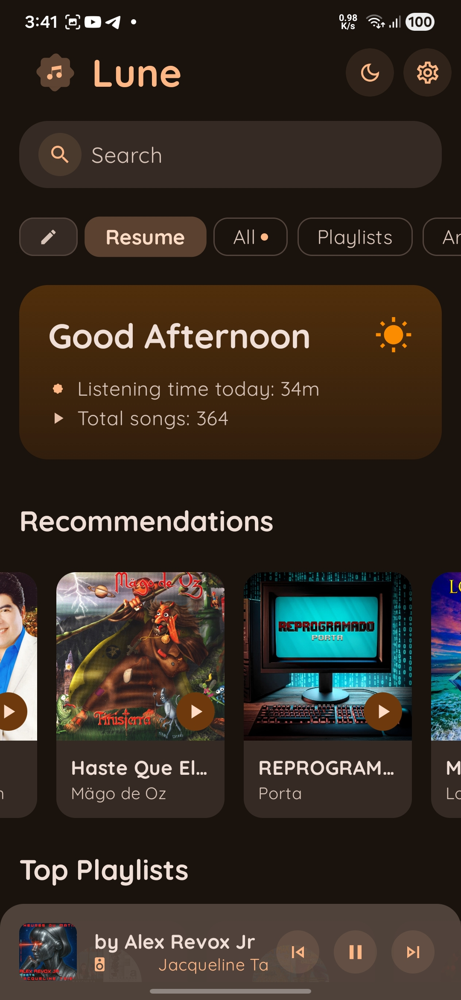
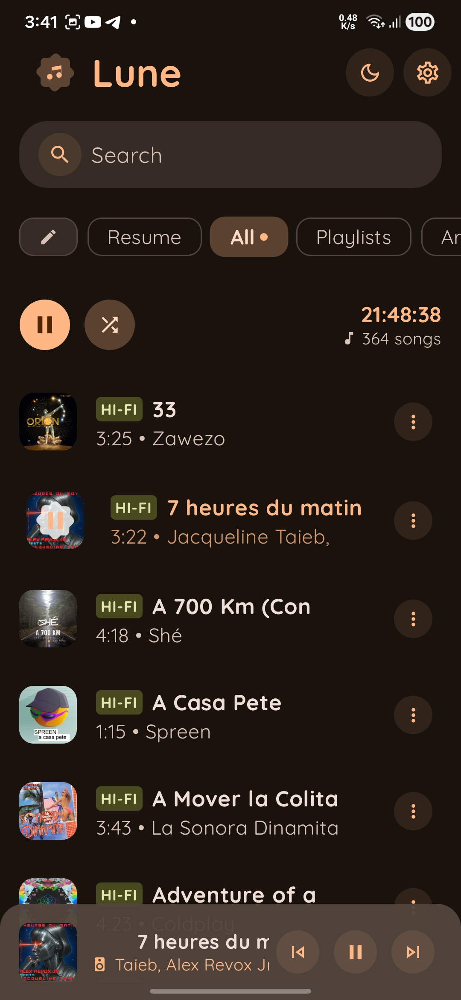
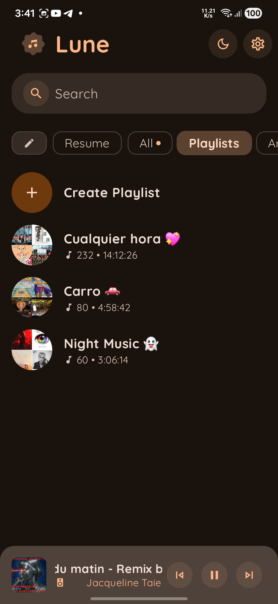
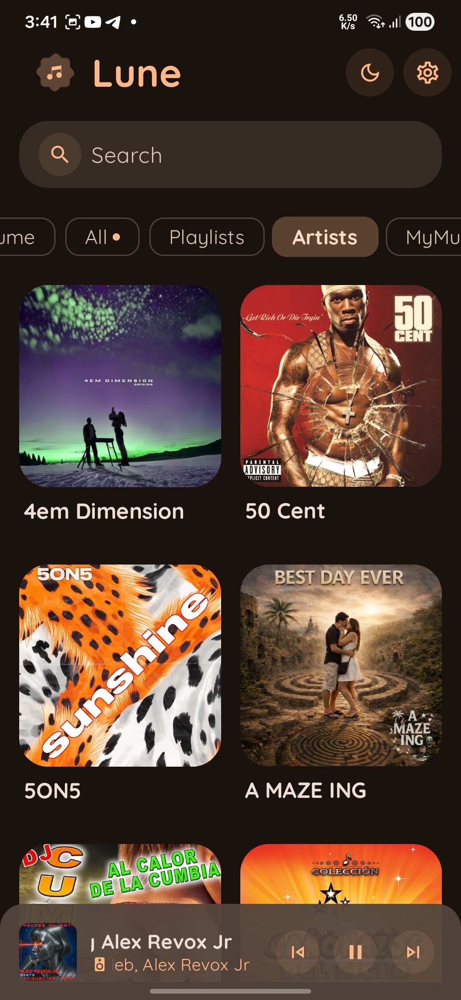
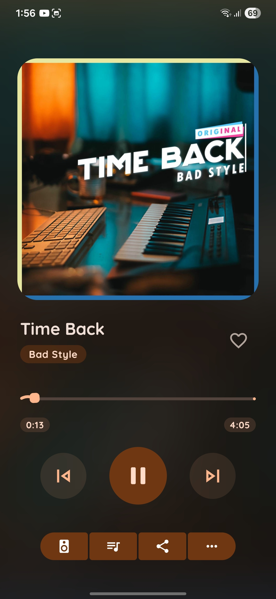
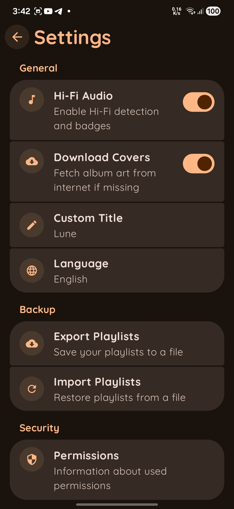
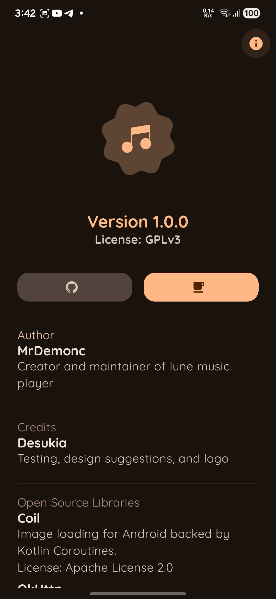
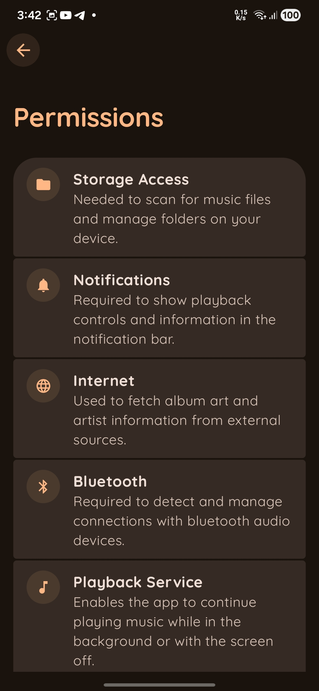
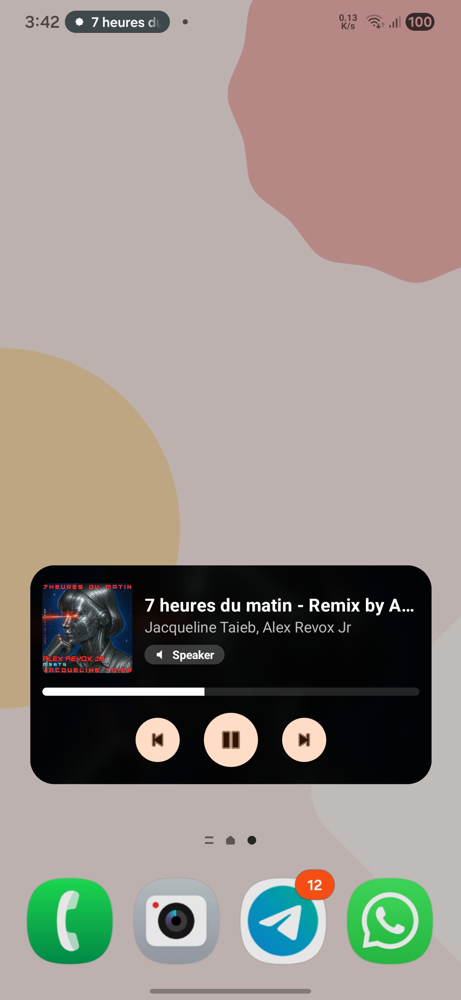
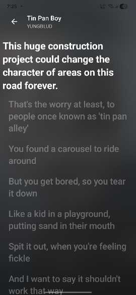

<p align="center">
  
  <br><br>
    <p align="center">
      
      
      
    </p>
    <p align="center">
      Lune is a minimalist and elegant music player for Android, designed with a focus on aesthetics and a premium user experience. 
      It features a modern Jetpack Compose UI, dynamic color support, and a unique high-quality dark defocus widget system.
    </p>
</p>

## ✨ Features

- **Modern UI**: Built with Jetpack Compose for a fluid, responsive interface.
- **Premium Widget**: Home screen widget featuring a professional "dark defocus" effect powered by RenderScript.
- **Live Lyrics**: Integrated lyrics viewer with synchronized scrolling and smooth animations.
- **Dynamic Themes**: Responsive to system color schemes and dark mode.
- **Queue Control**: Robust playback management with shuffle, repeat, and queue persistence.
- **Playlist**: The ability to create your own playlists with the music you like, separate from the rest.
- **Automix and Crossfade**: 12-second transition effect when changing songs, for a smooth transition.
- **Timer**: Set a timer to turn off playback; available times: off, 15m, 30m, 60m.
- **Equalize**: It includes an equalizer with several preset modes, including additional options to enhance bass and use spatial audio.
- **Vizulizer**: Bar display that moves to the rhythm of the music.
- **Sample button theme**: A simple button that allows you to change the application's light or dark mode (includes automatic mode, taking the system mode).
- **HI-FI audio**: The application supports audio in HI-FI formats.
- **Language**: Available in Spanish and English.
- **Custom tittle**: Customize the application title from the settings.
- **Cover download**: The application can access the internet to download song covers using the Deezer API; this option can be disabled in settings.

## 📱 ScreenShot

<p align="center">
  
  
  
  
  
</p>

<p align="center">
  
  
  
  
  
</p>

## 🛠 Build Requirements

To build Lune from source, ensure your environment meets the following requirements:

- **JDK 17+**: Required for the current Gradle build version.
- **Android SDK 36**: The project targets and compiles with the latest Android 15 APIs (SDK 36).
- **Gradle**: Uses the provided Gradle wrapper (8.x+).

Create this file for signing release

**keystore.properties**:

```bash
storeFile=key-file.jks
storePassword=password
keyAlias=alias
keyPassword=password
```

## 🚀 How to Build

1. **Clone the repository**:
   ```bash
   git clone https://github.com/MrDemonc/Lune.git
   cd Lune
   ```
2. **Setup Environment**:
   Ensure `ANDROID_HOME` is set to your local Android SDK location.
3. **Build via Command Line**:
   Run the following command to generate the release APK:
   ```bash
   ./gradlew assembleRelease
   ```
   The output APK will be available at: `app/build/outputs/apk/release/app-release.apk` (if not signed).

## 📱 F-Droid Information

Lune is designed to be fully open-source and compatible with F-Droid's build standards:

- **Pure Gradle Build**: No proprietary pre-compiled binaries.
- **Standard Metadata**: Compatible with F-Droid build recipes.

## 💰 Donation

If you would like to support the development of Lune, you can do so through the following platforms:

- **PayPal**: [https://www.paypal.com/paypalme/TommyZambrano](https://www.paypal.com/paypalme/TommyZambrano)

## 🤝 Credits

- **MrDemonc**: Project Creator & Lead Developer.
- **Desukia**: Design testing and UX feedback.

---

_Lune - Listen with style._
